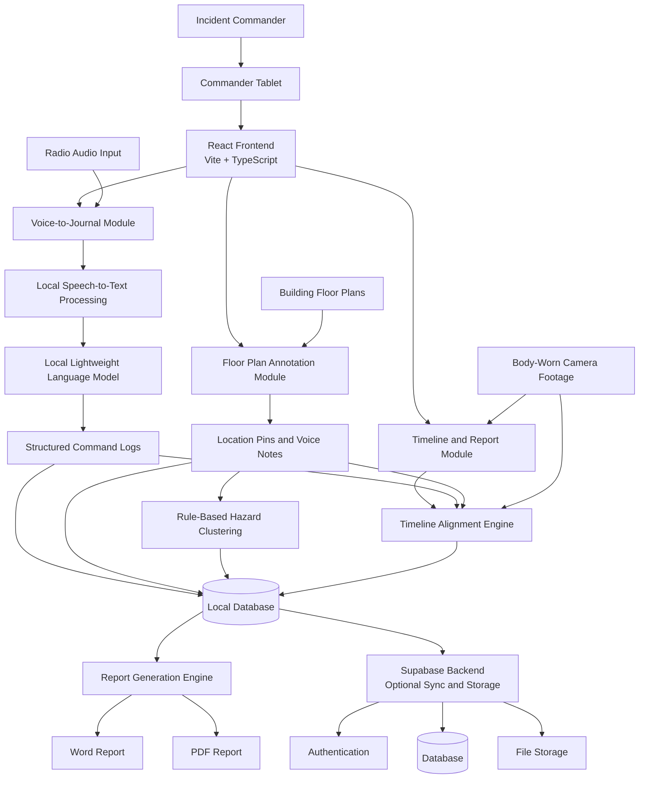
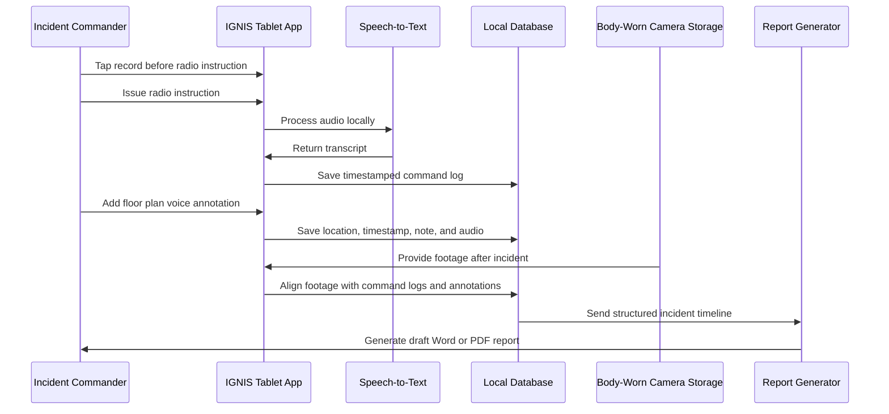

# Project IGNIS

## Overview

Project IGNIS, also known as **Intelligent Ground Narrative & Incident Stream**, is a tablet-based incident command support application designed for SCDF frontline commanders.

IGNIS helps incident commanders capture radio instructions, annotate floor plans, identify hazard zones, align incident records with body-worn camera footage, and generate post-incident reports more efficiently.

The project was developed for the **SCDF X Dell Lifesavers' Innovation Challenge 2026**.

## Application Link

[Miaoda Application](https://medo.dev/projects/app-bphlrz3482rl)

---

## Problem Statement

SCDF frontline responders operate in high-pressure environments where incident commanders need to manage multiple streams of information at once.

Project IGNIS addresses three key operational challenges:

1. **Cognitive load during incidents**  
   Incident commanders need to remember team positions, hazards, orders issued, and tasks outstanding during stressful operations.

2. **Unstructured command communication**  
   Radio instructions are not automatically captured in a structured and searchable format.

3. **Manual post-incident report generation**  
   Incident reports often require manual reconstruction using notes, photographs, floor plans, radio recordings, and body-worn camera footage.

---

## Proposed Solution

IGNIS provides a digital working surface for incident commanders.

The application allows commanders to:

- Record and timestamp radio instructions
- Convert voice instructions into structured logs
- Annotate digital floor plans with voice notes
- Highlight possible hazard zones based on clustered observations
- Align command logs, floor-plan annotations, and body-worn camera footage
- Generate draft incident reports in Word or PDF format

IGNIS is designed to support existing SCDF workflows without replacing current radio communication or body-worn camera systems.

---

## Core Modules

### 1. Voice-to-Journal

The commander taps a button before issuing a radio instruction. IGNIS captures the audio, transcribes it locally, timestamps it, and stores it as a structured incident log entry.

This helps create a searchable audit trail of command instructions.

### 2. Floor Plan Annotations and Hazard Heatmap

The commander can tap on a digital floor plan and record a short voice note. Each annotation stores the location, timestamp, transcript, and original audio.

When multiple annotations or reports are clustered in the same area within a short time, IGNIS can highlight the area as a possible hazard zone.

### 3. Timeline Alignment and Report Generation

After the incident, IGNIS aligns the commander's voice logs, floor-plan annotations, and body-worn camera footage into a single timeline.

The system then generates a draft incident report with:

- Ordered command timeline
- Annotated floor plan
- Scene observations
- Relevant incident records
- Export-ready Word or PDF format

---

## Solution Architecture



---

## Architecture Description

The user interacts with IGNIS through a commander tablet. The frontend is built using React, TypeScript, and Vite.

The application contains three main modules:

| Module | Purpose |
|---|---|
| Voice-to-Journal | Captures, transcribes, timestamps, and structures radio instructions |
| Floor Plan Annotation | Allows commanders to place voice-linked notes on digital floor plans |
| Timeline and Report Generation | Aligns logs, annotations, and body-worn camera footage into a report-ready timeline |

The system processes key incident data locally where possible. This supports reliability in environments where network access may be weak, such as stairwells, basements, tunnels, or dense urban areas.

Supabase can be used as an optional backend for authentication, database storage, file storage, and synchronisation when centralised storage is required.

---

## Data Flow



---

## Key Features

- Tablet-based incident command support
- Local speech-to-text transcription
- Structured command logging
- Timestamped incident timeline
- Digital floor plan annotation
- Voice-linked hazard notes
- Rule-based hazard heatmap
- Body-worn camera timeline alignment
- Draft incident report generation
- Word and PDF export
- Optional Supabase backend integration

---

## Tech Stack

| Category | Technology |
|---|---|
| Frontend | React |
| Build Tool | Vite |
| Language | TypeScript |
| Backend / Database | Supabase |
| Package Manager | npm |
| Styling | CSS / Tailwind if configured |
| Deployment | Web-based deployment |

---

## Project Directory

```txt
├── README.md                 # Project documentation
├── components.json           # Component library configuration
├── index.html                # HTML entry file
├── package.json              # Project dependencies and scripts
├── postcss.config.js         # PostCSS configuration
├── vite.config.ts            # Vite configuration
├── tsconfig.json             # TypeScript configuration
├── tsconfig.app.json         # TypeScript frontend configuration
├── tsconfig.node.json        # TypeScript Node.js configuration
│
├── public                    # Static assets
│   ├── favicon.png           # Website icon
│   └── images                # Image assets
│
└── src                       # Source code
    ├── App.tsx               # Main application component
    ├── main.tsx              # Application entry point
    ├── routes.tsx            # Route configuration
    ├── index.css             # Global styles
    │
    ├── components            # Reusable UI components
    ├── context               # Global state and context providers
    ├── db                    # Database configuration
    ├── hooks                 # Custom React hooks
    ├── layout                # Page layouts
    ├── lib                   # Utility functions
    ├── pages                 # Application pages
    ├── services              # Backend and database interactions
    └── types                 # TypeScript type definitions
```

---

## Getting Started

Follow the steps below to set up and run the project locally.

---

## Editing the Code Locally

You can use [Visual Studio Code](https://code.visualstudio.com/Download) or any IDE you prefer.

The only requirement is to have Node.js and npm installed before running the project locally.

---

## Prerequisites

Make sure you have Node.js and npm installed.

Recommended versions:

```bash
Node.js >= 20
npm >= 10
```

Check your installed versions:

```bash
node -v
npm -v
```

Example:

```bash
node -v   # v20.18.3
npm -v    # 10.8.2
```

---

## Installing Node.js

### Windows

1. Visit the official Node.js website: <https://nodejs.org/>
2. Download the recommended Windows installer.
3. Run the installer.
4. Follow the installation wizard until installation is complete.
5. Open Command Prompt, PowerShell, or your IDE terminal.
6. Verify that Node.js and npm are installed correctly:

```bash
node -v
npm -v
```

### macOS

You can install Node.js using Homebrew.

```bash
brew install node
```

Then verify the installation:

```bash
node -v
npm -v
```

Alternatively, you can download the macOS installer from the official Node.js website:

<https://nodejs.org/>

Open the downloaded `.pkg` file and follow the installation instructions.

---

## Installation

### 1. Clone or download the project

Clone the repository:

```bash
git clone <repository-url>
```

Replace `<repository-url>` with the actual GitHub repository URL.

Alternatively, download the project as a ZIP file and extract it.

### 2. Open the project folder

Open the project folder using Visual Studio Code or your preferred IDE.

Then navigate into the project folder using the terminal:

```bash
cd <project-folder>
```

Replace `<project-folder>` with the actual folder name.

### 3. Install dependencies

```bash
npm install
```

You can also use:

```bash
npm i
```

### 4. Start the development server

```bash
npm run dev -- --host 127.0.0.1
```

If the command above does not work, try:

```bash
npx vite --host 127.0.0.1
```

### 5. Open the application

After the development server starts, open the local URL shown in the terminal.

It usually looks like this:

```txt
http://127.0.0.1:5173
```

---

## Environment Configuration

If the project uses Supabase or other external services, create a `.env` file in the project root.

Example:

```env
VITE_SUPABASE_URL=your_supabase_project_url
VITE_SUPABASE_ANON_KEY=your_supabase_anon_key
```

Do not commit real API keys, passwords, tokens, or secrets to GitHub.

---

## Backend Services

This project may use Supabase for backend services. If a database is required, use the official version of Supabase.

Supabase can support:

- User authentication
- Database storage
- File storage
- Backend API access
- Optional cloud synchronisation

Backend and database interaction logic should be placed inside:

```txt
src/services
src/db
```

---

## Development Guidelines

- Keep reusable UI elements inside the `components` directory.
- Keep page-level screens inside the `pages` directory.
- Keep shared layouts inside the `layout` directory.
- Keep database configuration inside the `db` directory.
- Keep backend interaction logic inside the `services` directory.
- Keep shared TypeScript definitions inside the `types` directory.
- Avoid hardcoding configuration values.
- Use environment variables for API keys and service URLs.
- Do not commit sensitive information to GitHub.
- Test major user flows before pushing changes.

---

## Useful Commands

Install dependencies:

```bash
npm install
```

Start development server:

```bash
npm run dev
```

Start development server with local host binding:

```bash
npm run dev -- --host 127.0.0.1
```

Fallback development server command:

```bash
npx vite --host 127.0.0.1
```

Build the project:

```bash
npm run build
```

Preview the production build:

```bash
npm run preview
```

---

## Expected Impact

IGNIS aims to improve incident command support by:

- Reducing manual report writing work
- Reducing information loss after incidents
- Helping commanders review what was ordered and when
- Supporting better after-action reviews
- Creating a clearer incident timeline
- Improving situational awareness through floor plan annotations
- Supporting safer and more structured frontline operations

---

## Privacy and Safety Considerations

IGNIS is designed as an assistive tool for incident commanders.

Important safeguards include:

- Local processing where possible
- Original audio retained for verification
- AI-generated text treated as draft output
- Human review before report finalisation
- Role-based access for sensitive incident records
- No replacement of existing radio communication workflows
- Graceful failure if the tablet loses power or connectivity

---

## Learn More

You can check the Miaoda help documentation for more details on downloading and building the app:

[Miaoda Documentation: Downloading and Building the App](https://intl.cloud.baidu.com/en/doc/MIAODA/s/download-and-building-the-app-en)
